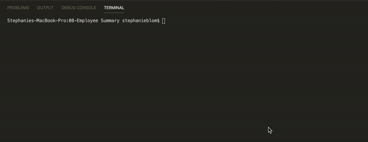
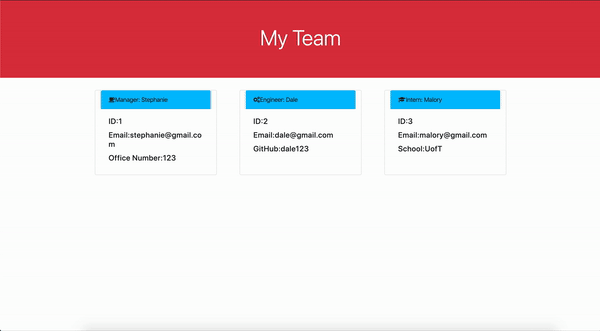

# 09-Employee-Summary

# DEMO 

# Description 

As a manager you can view all employees with their information. 
Once node has been insalled and npm has been initialized and installed... 
Run node and you are prompted to input the manager data:
- Name 
- Email 
- Office Number 
- Number of Employees 

For each employee you will be prompted to fill in if they are an Intern or Engineer. 
If they are an Engineer you will be prompted to complete the following: 
- Name 
- Email 
- Github 

If they are an Intern you will be prompted for the following: 
- Name 
- Email 
- School 

Once all employee information has been included the html file is written and can be opened. 
